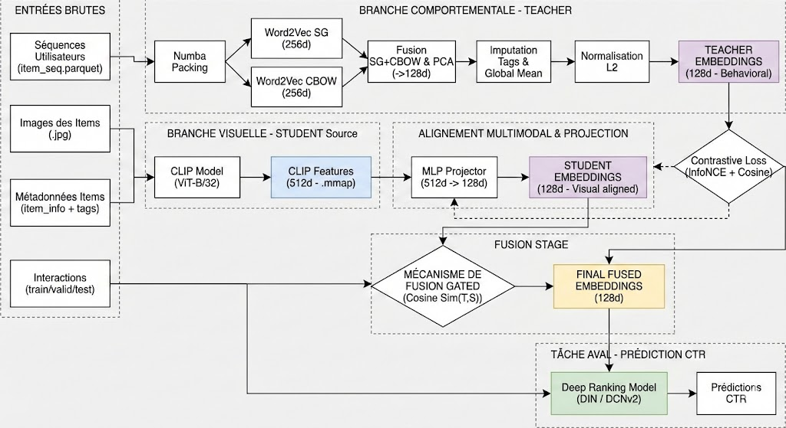

# MM-CTR (WWW 2025) — MicroLens_1M_x1  
## Multimodal Item Embedding Pipeline (Sequences + Images)

Ce projet implémente un **pipeline complet de génération d’embeddings items 128D** pour le challenge **Multimodal Click-Through Rate Prediction (MM-CTR – WWW 2025)**, basé sur le dataset **MicroLens_1M_x1**.

Le pipeline combine :
- **Séquences utilisateurs** (Word2Vec) → *Teacher*
- **Images produits** (CLIP) → *Student*
- **Distillation multimodale** via un Projector MLP
- **Fusion adaptive (Gating)** Teacher / Student
- **Intégration avec le repo officiel MM-CTR**
- **Génération de `prediction.csv` (Task2 baseline)**

---

## 1. Environnement

### Plateforme
- **Kaggle Notebook**
- GPU recommandé (T4 / P100 / A100)

### Installation des dépendances
```bash
pip -q install -U "transformers>=4.41" datasets polars pyarrow gensim tqdm scikit-learn accelerate
```

### Librairies principales
- `polars` : lecture/écriture parquet (streaming, RAM-safe)
- `gensim` : Word2Vec
- `transformers` : CLIP
- `torch` : entraînement + AMP
- `numpy.memmap` : stockage disque des features images

---

## 2. Données

### Structure attendue
```text
www2025-mmctr-data/
└── MicroLens_1M_MMCTR/
    ├── MicroLens_1M_x1/
    │   ├── train.parquet
    │   ├── valid.parquet
    │   ├── test.parquet
    │   └── item_info.parquet
    ├── item_seq.parquet
    └── item_images/
        └── item_images/
            ├── 1.jpg
            ├── 2.jpg
            └── ...
```

### Chemins configurés automatiquement
```python
cfg.ITEM_INFO = ".../MicroLens_1M_x1/item_info.parquet"
cfg.TRAIN     = ".../MicroLens_1M_x1/train.parquet"
cfg.VALID     = ".../MicroLens_1M_x1/valid.parquet"
cfg.TEST      = ".../MicroLens_1M_x1/test.parquet"
cfg.ITEM_SEQ  = ".../item_seq.parquet"
cfg.IMG_DIR   = ".../item_images/item_images"
```

---

## 3. Pipeline global

```
User Sequences ──► Word2Vec (SG + CBOW) ──► PCA ──► Teacher 128D
                                           │
Item Images ──► CLIP ViT-B/32 ──► Projector ─┤
                                           ▼
                               Cosine-based Gating
                                           ▼
                                Final Item Embedding 128D
```

---
## 3.b Architecture (schéma)

<p align="center">
  
</p>

**Lecture rapide :**
- **Branche comportementale (Teacher)** : Word2Vec (SG+CBOW) → PCA → Imputation tags → Normalisation L2 → *Teacher 128d*
- **Branche visuelle (Student)** : CLIP (ViT-B/32) → features 512d (memmap) → MLP Projector → *Student 128d*
- **Alignement** : loss **Cosine + InfoNCE**
- **Fusion** : gating basé sur `cos(Teacher, Student)` → *Final 128d*


## 4. Étapes détaillées

### 4.1 Teacher — Word2Vec sur séquences
- Chargement RAM-safe de `item_seq.parquet`
- Filtrage utilisateurs (`user_id % KEEP_MOD`)
- Word2Vec :
  - Skip-Gram + CBOW
  - Dimension 256 → PCA → 128
- Imputation des items manquants via `item_tags`
- Normalisation L2

**Sortie**
- `item_info.parquet` avec `item_emb_d128`

---

### 4.2 Student — CLIP (Images)
- Modèle : `openai/clip-vit-base-patch32`
- Extraction image → vecteur 512D
- Stockage disque via `numpy.memmap` (float16)

**Sortie**
- `clip_img_feats.f16.mmap`

---

### 4.3 Distillation — Projector MLP
- Architecture : `512 → 256 → 128`
- Loss :
  - Cosine loss
  - InfoNCE symétrique (in-batch)
- Entraînement en AMP (fp16)

---

### 4.4 Fusion multimodale (Gating)
Formule :
```math
g = clamp((cos(t, s) + 1) / 2)
v = normalize(g · t + (1 - g) · s)
```

- `t` : teacher normalisé
- `s` : student normalisé

**Sortie**
- Embedding final 128D par item

---

### 4.5 Export final
- Mise à jour de `item_info.parquet`
- Duplication pour compatibilité :
  - `item_emb_d128` → `item_emb`

**Fichiers générés**
```text
/kaggle/working/
├── item_info.parquet
├── item_info_updated.parquet
├── clip_img_feats.f16.mmap
```

---

## 5. Intégration repo officiel MM-CTR (optionnel)

Le notebook :
1. Clone `WWW2025_MMCTR_Challenge`
2. Copie les données dans `repo/data/MicroLens_1M_x1`
3. Génère des configs YAML personnalisées (DIN / DCNv2)
4. Patch compatibilité NumPy 2.0 (`np.Inf → np.inf`)
5. Lance le tuner :
```bash
python run_param_tuner.py --config <CONFIG.yaml> --gpu 0
```

---

## 6. Baseline Task2 — prediction.csv

Baseline simple par popularité :
```math
CTR(item) = (clicks + 1) / (impressions + 2)
```

Fallback :
```math
CTR_global
```

**Fichier généré**
```text
prediction-task2.csv
```

Format :
```csv
ID,Task2
```

---

## 7. Bonnes pratiques & performance

- Réduire `KEEP_MOD` → plus de données (meilleur AUC)
- Augmenter `W2V_EPOCHS` (10–15 recommandé)
- Réduire batch CLIP si OOM GPU
- `memmap` indispensable pour stabilité RAM

---

## 8. Checklist finale

✅ `item_id = 0` = padding (vecteur nul)  
✅ Embeddings 128D normalisés  
✅ Aucun NaN  
✅ CSV conforme (`ID`, `Task2`)  
✅ Compatible repo officiel MM-CTR  
